# Retail Sales Data Pipeline - AWS Data Engineering Project

A fully automated, event-driven data pipeline built entirely on AWS managed services. Every file uploaded to S3 is validated, cleansed, transformed, cataloged, and made queryable with zero manual intervention after upload, plus built-in monitoring, alerting, and daily scheduling.

Built hands-on through the **AWS Management Console** (no Infrastructure as Code).

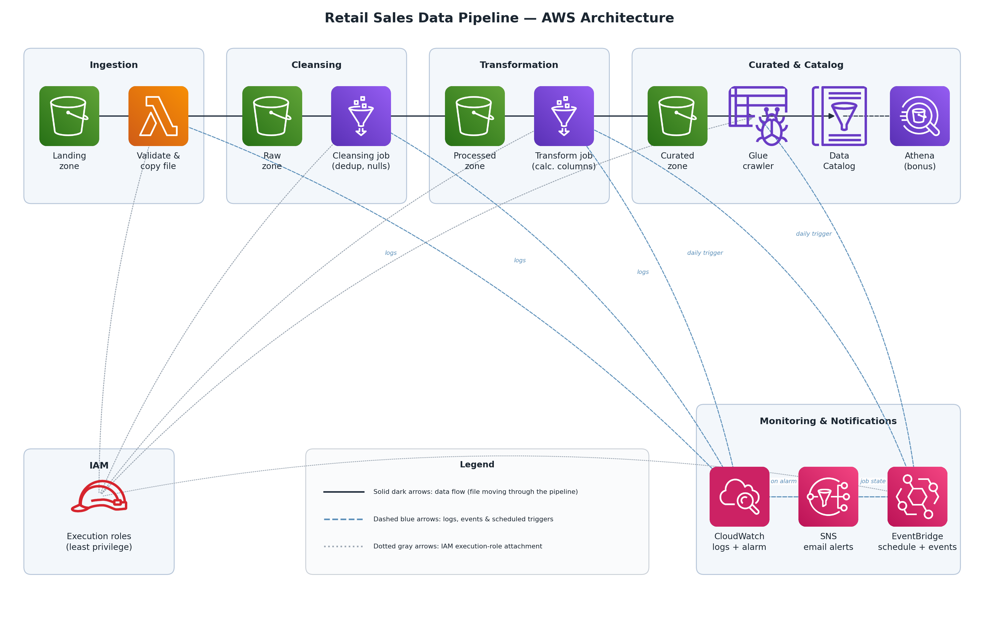

---

## Table of Contents

- [Project Overview](#project-overview)
- [AWS Services Used](#aws-services-used)
- [Workflow Description](#workflow-description)
- [Repository Structure](#repository-structure)
- [Step-by-Step Implementation](#step-by-step-implementation)
- [Design Decisions](#design-decisions)
- [Testing & Validation](#testing--validation)
- [Sample Dataset](#sample-dataset)
- [Bonus Tasks](#bonus-tasks)
- [Challenges Faced](#challenges-faced)
- [Learning Outcomes](#learning-outcomes)
- [Future Improvements](#future-improvements)

---

## Project Overview

A retail organization receives daily sales files from multiple branch offices, uploaded manually into S3. This project automates everything that happens after upload: validating the file, cleaning the data, enriching it with calculated business columns, cataloging it for analytics, and notifying a human of every Glue job's outcome (success or failure) so status is never something you have to go check for manually.

**Core requirement met:** upload a file, and with no further human action it flows through validation, cleansing, transformation, cataloging, monitoring, and notification, and is queryable via Athena within minutes.

## AWS Services Used

| Service | Role in this project |
|---|---|
| **Amazon S3** | Single bucket, four-zone folder structure (landing → raw → processed → curated) |
| **AWS Lambda** | Validates uploaded files and copies them from landing to raw |
| **AWS Glue Jobs** | Two PySpark ETL jobs: cleansing (dedup/nulls) and transformation (calculated columns) |
| **AWS Glue Crawler** | Scans the curated zone and infers/updates the table schema |
| **AWS Glue Data Catalog** | Stores the resulting table metadata, queryable via Athena |
| **Amazon CloudWatch** | Centralized logs for Lambda and Glue, plus a failure alarm |
| **Amazon SNS** | Email notifications for job success/failure |
| **Amazon EventBridge** | Rule for Glue job state-change events (→ SNS) and Scheduler for daily automation |
| **AWS IAM** | Scoped execution roles for Lambda, Glue, and EventBridge Scheduler |
| **Amazon Athena** | On-demand SQL querying of the curated table, run manually whenever needed (not scheduled) |

## Workflow Description

```
Upload File
     │
     ▼
Landing Zone (S3)
     │
     ▼
S3 Event Notification ──► AWS Lambda (validate + copy)
     │
     ▼
Raw Zone (S3)
     │
     ▼
Glue ETL Job - Cleansing (dedup, drop nulls, → Parquet)
     │
     ▼
Processed Zone (S3)
     │
     ▼
Glue ETL Job - Transformation (+ total_price, + order_month)
     │
     ▼
Curated Zone (S3)
     │
     ├──► Glue Crawler ──► Glue Data Catalog ──► Athena
     ├──► CloudWatch (logs + failure alarm)
     ├──► SNS (email: success / failure)
     └──► EventBridge (daily schedule for crawler + transformation job)
```

Every arrow above except the S3 zones and EventBridge schedule triggers automatically, no manual step is required between upload and the data becoming queryable.

## Repository Structure

```
aws-retail-data-pipeline/
├── README.md
├── architecture-diagram.png
├── .gitignore
├── src/
│   ├── lambda/
│   │   └── s3_ingestion_validator.py
│   └── glue/
│       ├── cleansing_job.py
│       └── transformation_job.py
├── sample-data/
│   └── sales_data.csv
└── screenshots/
    ├── phase00_setup/
    ├── phase01_storage/
    ├── phase02_ingestion/
    ├── phase03_cleansing/
    ├── phase04_transformation/
    ├── phase05_metadata/
    ├── phase06_monitoring/
    ├── phase07_notifications/
    ├── phase08_scheduling/
    └── phase09_final_output/
```

## Step-by-Step Implementation

### Phase 0: Setup
Created a dedicated IAM user (not root) for all project work, and a zero-spend AWS Budget alert as a safety net before provisioning anything.

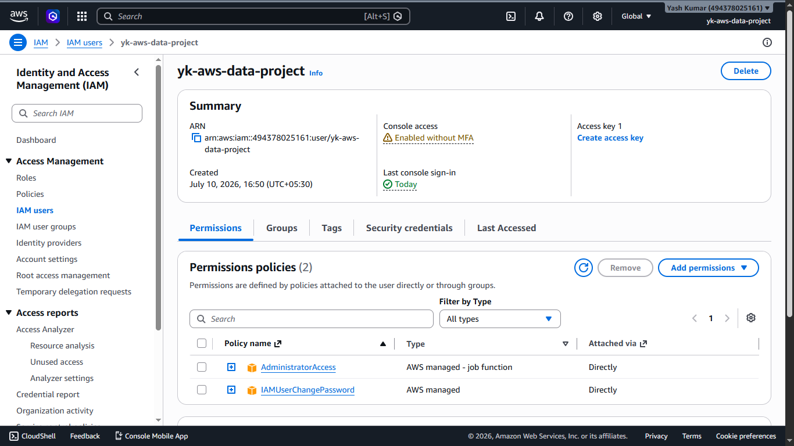

### Phase 1: Storage Layers
One S3 bucket with four prefixes (`landing/`, `raw/`, `processed/`, `curated/`) rather than four separate buckets (see [Design Decisions](#design-decisions)). Block Public Access, versioning, and SSE-S3 encryption enabled.

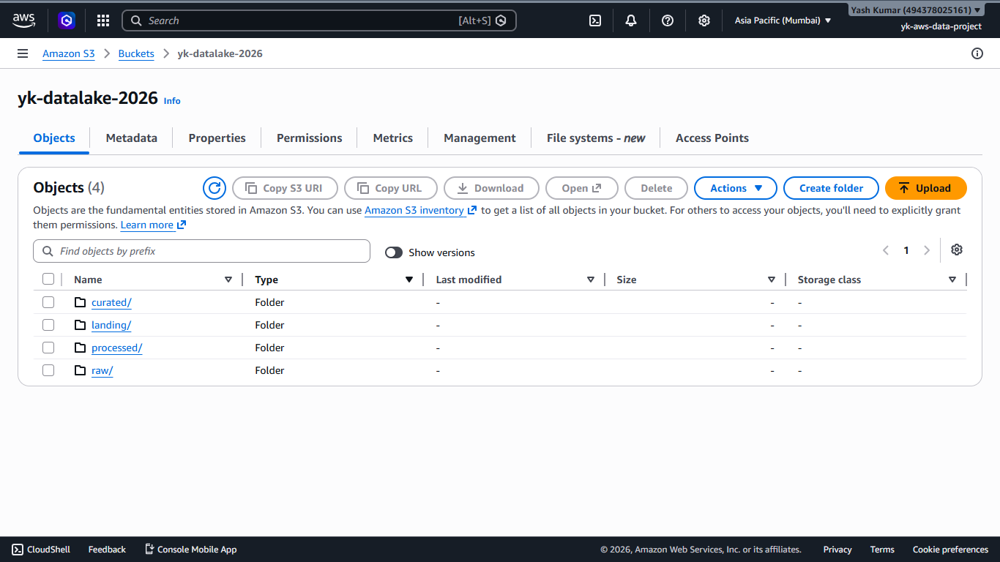

### Phase 2: Ingestion (Lambda)
A Lambda function (`s3_ingestion_validator.py`) triggered on `s3:ObjectCreated:*` events scoped to the `landing/` prefix. It rejects files that aren't `.csv`/`.parquet` or are empty, then copies valid files into `raw/`, logging every decision to CloudWatch.

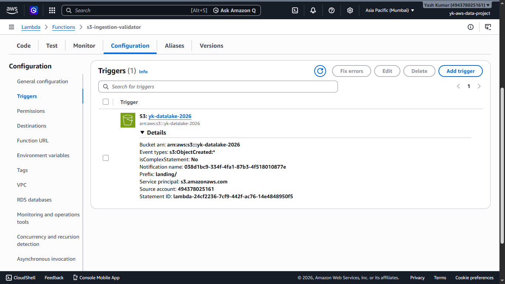

### Phase 3: Data Cleansing (Glue Job)
A PySpark Glue job (`cleansing_job.py`) reads from `raw/`, removes exact duplicate rows, drops rows missing any mandatory field (`branch`, `product`, `quantity`, `unit_price`), and writes clean Parquet output to `processed/`.

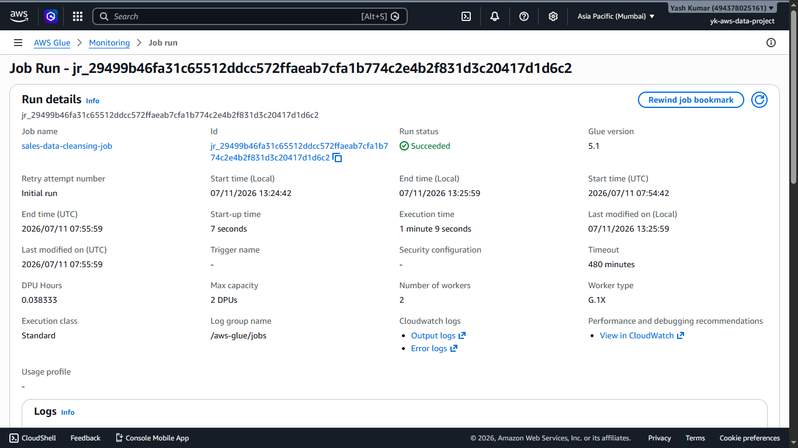

### Phase 4: Data Transformation (Glue Job)
A second Glue job (`transformation_job.py`) reads from `processed/`, adds two calculated columns (`total_price` (`quantity × unit_price`) and `order_month` (extracted from `order_date`)) and writes to `curated/`.

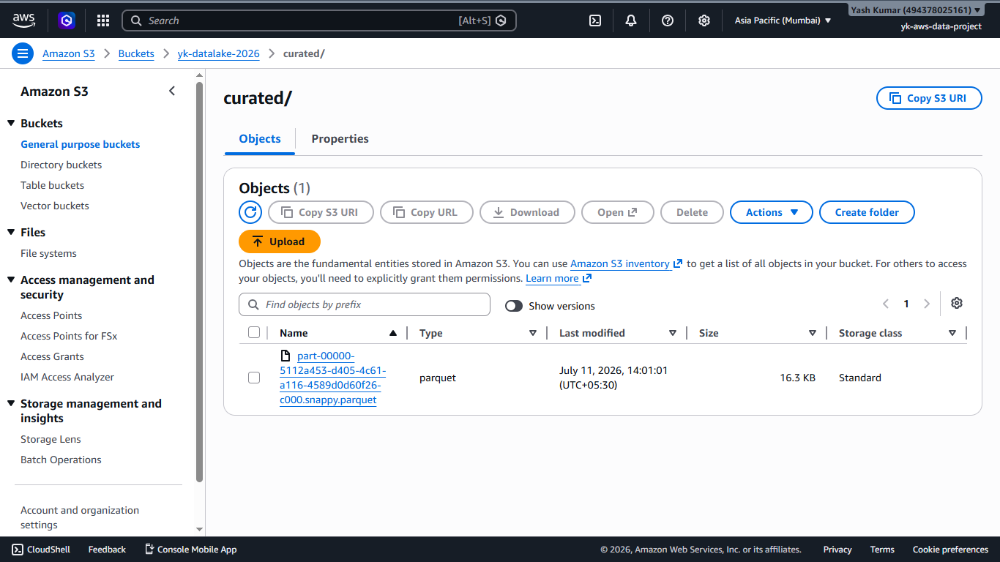

### Phase 5: Metadata (Crawler + Data Catalog)
A Glue Crawler scans `curated/` and registers the schema as a table inside a dedicated Glue Database (`retail_sales_db`), making the data immediately queryable via Athena.

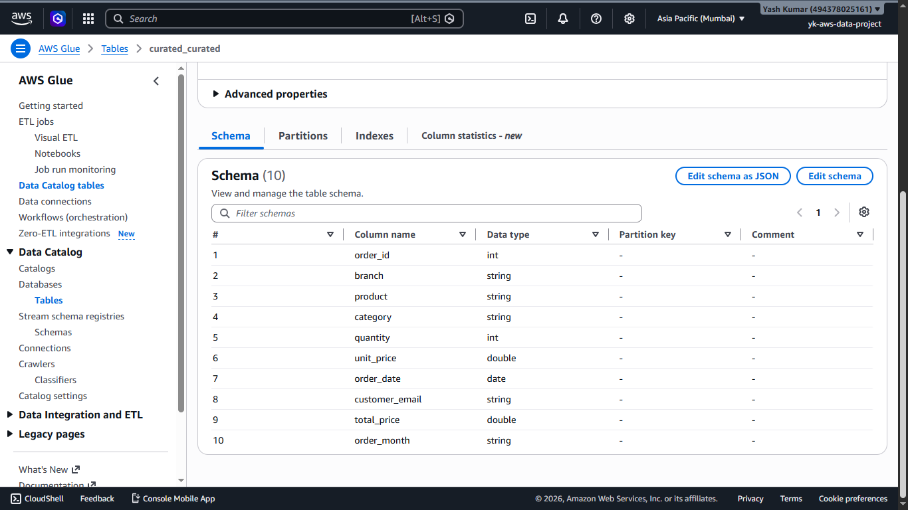

### Phase 6: Monitoring (CloudWatch)
Lambda and both Glue jobs log automatically to CloudWatch. A CloudWatch Alarm watches `glue.driver.aggregate.numFailedTasks` and fires the moment a job produces even one failed task.

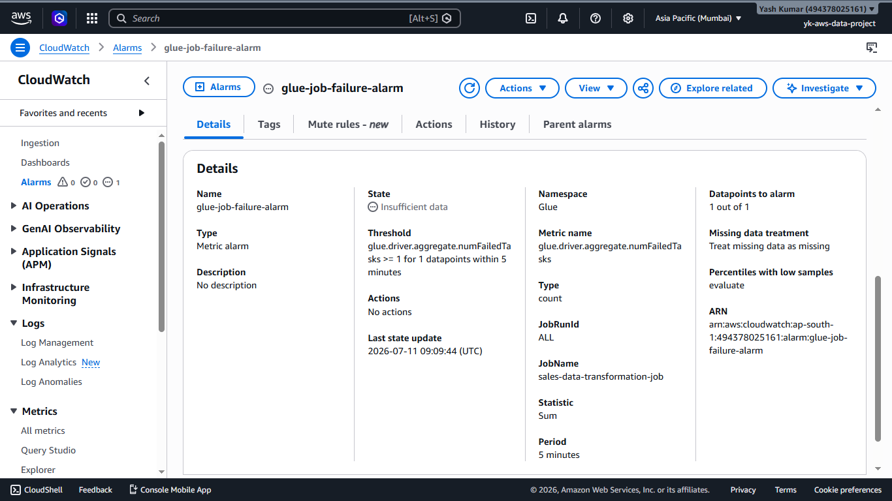

### Phase 7: Notifications (SNS + EventBridge)
An SNS topic with a confirmed email subscription, wired to:
- A **CloudWatch Alarm action** (Glue job failure via metric threshold)
- A **Lambda asynchronous invocation destination** (Lambda-level failure)
- An **EventBridge rule** matching Glue Job State Change events (`SUCCEEDED`/`FAILED`) via a custom JSON pattern, since the visual pattern builder doesn't expose nested `detail` fields

This was validated with a deliberate end-to-end failure test (see [Testing & Validation](#testing--validation)).

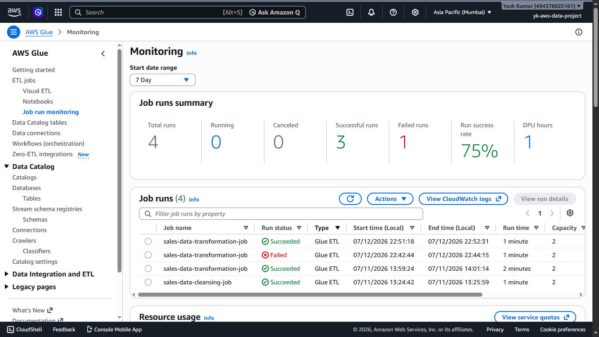

### Phase 8: Scheduled Execution (EventBridge Scheduler)
Two EventBridge Scheduler schedules automate the pipeline daily, with no manual trigger required:
- **Transformation job** - 7:00 PM IST
- **Glue crawler** - 7:15 PM IST (15 minutes after, so it always catalogs same-day output)

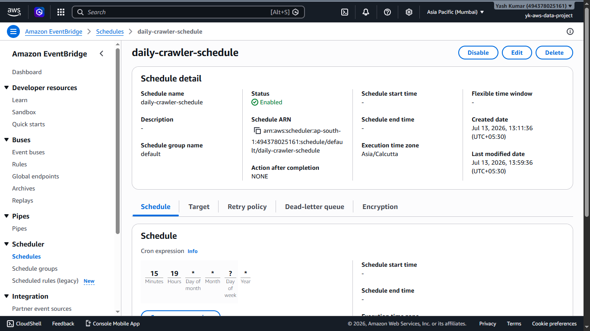

### Phase 9: Verification & Athena
Queried the final curated table directly through Amazon Athena to confirm the schema and data were correct, including a aggregation query (total sales per branch per month).

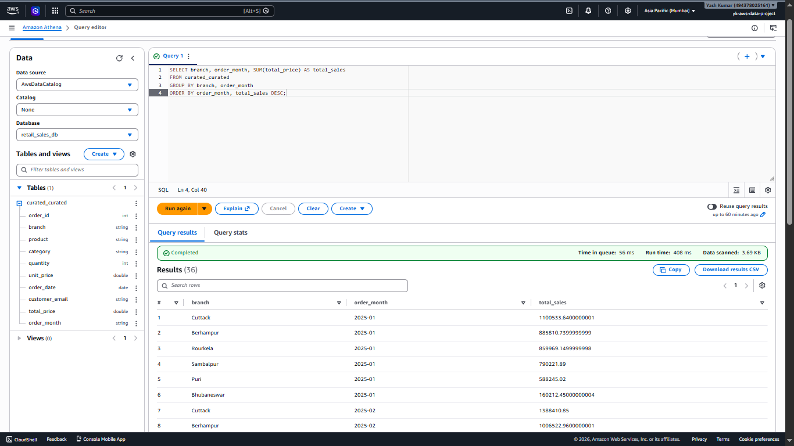

## Design Decisions

**Single bucket, four prefixes (not four buckets).** Simpler permissions and configuration to manage, and mirrors how most real-world data lakes are structured.

**SSE-S3 over SSE-KMS.** AWS enables SSE-S3 by default with no extra configuration or per-request cost, appropriate for non-sensitive synthetic demo data. SSE-KMS would add cost and IAM complexity with no real benefit here.

**G.1X workers, count 2, for both Glue jobs.** The dataset is under 600 rows; this is the smallest practical worker configuration, keeping cost near-zero without sacrificing correctness.

**Job bookmarks disabled during development.** Bookmarks skip previously-processed files on rerun. Useful in production, but actively unhelpful while iterating and re-testing the same file.

**Standard SNS topic, not FIFO.** Ordering and exactly-once delivery don't matter for status emails; Standard is simpler and has no throughput constraints.

**Custom JSON event pattern in EventBridge.** The visual pattern-builder UI doesn't expose nested `detail.jobName` / `detail.state` fields, so the rule was authored directly as JSON to filter on specific jobs and states.

**Reused a single Glue execution role** (`glue-etl-role`) across both Glue jobs and the crawler, since all three need the same underlying S3 + Glue + CloudWatch permissions.

**Custom trust policy for the EventBridge Scheduler role.** The console's "auto-create role" option was unavailable in this account, so the execution role (trusting `scheduler.amazonaws.com`) was created manually via IAM.

**No Infrastructure as Code, by design.** This project was deliberately built step-by-step through the AWS Console to build a genuine, hands-on understanding of how each service, permission, and event trigger connects, rather than abstracting that away behind Terraform/CloudFormation from the start. A natural next step (see [Future Improvements](#future-improvements)) is reproducing this same pipeline as code, once the manual mental model is solid.

## Testing & Validation

Rather than trusting each component in isolation, the monitoring/notification chain was validated with one deliberate end-to-end test:

1. Temporarily pointed the transformation job's output path at a non-existent bucket and ran it.
2. The job failed with a clear `AccessDenied` / `PERMISSION_ERROR` message.
3. EventBridge caught the `FAILED` state-change event and published it to SNS.
4. A failure email arrived in the inbox within seconds, containing the exact error and failed job name.
5. Reverted the path, reran the job, it succeeded, and a matching **SUCCEEDED** notification email arrived, confirming both paths of the notification logic work, not just the failure path.

The job-run history below shows the full arc - two successful runs, one deliberate failure, one successful recovery:


The EventBridge Scheduler was validated the same way - a schedule was temporarily set to fire a few minutes ahead, confirmed to trigger the crawler successfully, then reset to its real daily production time.

## Sample Dataset

A synthetic 565-row retail sales dataset (`sample-data/sales_data.csv`), generated with intentional data-quality issues to give the cleansing job real work to do:

- **8 columns:** `order_id, branch, product, category, quantity, unit_price, order_date, customer_email`
- **25 exact duplicate rows** (to be removed by deduplication)
- **20 rows with a missing mandatory field** (`branch`, `product`, `quantity`, or `unit_price` blanked — to be dropped)
- **6 branch offices**, **12 products** across 2 categories, dates spanning January–June 2025

## Challenges Faced

- **`ConcurrentRunsExceededException`**: hit this twice by clicking "Run" on a Glue job again before the previous run had fully finished tearing down. Fixed by always confirming the Runs tab shows no active run before retriggering.
- **EventBridge Rules can't schedule**: discovered partway through Phase 8 that the Rules interface only supports event patterns, not cron/rate schedules; the correct tool is the separate **EventBridge Scheduler** service.
- **Cron timezone confusion**: initially assumed EventBridge Scheduler used UTC and manually converted IST → UTC, when the schedule was actually already set to execute in `Asia/Calcutta` local time. Cost a wasted test cycle before catching it via the schedule's own "Execution time zone" field.
- **Stale "Invalid cron expression" UI message**: the console displayed this error even after a schedule had already saved successfully; a page refresh confirmed the save was fine and the message was just unrefreshed client-side validation state.
- **IAM auto-create role disabled**: EventBridge Scheduler's "Create new role for this schedule" option was greyed out in this account, requiring a manually authored IAM role with a custom trust policy for `scheduler.amazonaws.com`.
- **Lambda missing SNS permissions**: configuring an "on failure" destination for asynchronous Lambda invocations failed until `sns:Publish` permission was explicitly added to the Lambda execution role, S3 and CloudWatch access don't imply SNS access.
- **EventBridge visual pattern builder limitations**: the no-code pattern form can't filter on nested fields like `detail.jobName`; switching to the custom JSON editor was required to scope the rule to specific jobs and states.

## Learning Outcomes

- Hands-on understanding of **least-privilege IAM roles and trust policies**, including how they differ from IAM users and why services (not people) assume roles.
- Practical experience with **event-driven serverless architecture** e.g. S3 event notifications, Lambda destinations, and EventBridge state-change rules.
- Applied a **medallion-style data lake structure** (raw → processed → curated) and understood why separating cleansing from transformation into two distinct Glue jobs aids debuggability.
- Learned that **effective monitoring means alerting on both success and failure**, validated through a deliberate, repeatable failure test rather than assuming configuration alone proves correctness.
- Gained real exposure to **cron scheduling nuances in the cloud** (particularly that time zone assumptions must always be explicitly verified, never assumed).
- Practiced **cost-conscious cloud development** e.g. budgets, minimal Glue worker counts, and understanding which resources incur idle cost versus only incurring cost while actively running.

## Future Improvements

- **Reproduce this pipeline in Terraform** as a follow-up project, now that every service and permission has been understood hands-on via the console.
- **Partition the curated data by year and month** to improve Athena query performance at larger scale.
- **Add a second Glue job for aggregation** (e.g., daily/monthly sales summaries per branch) as a downstream consumer of the curated table.
- **Re-enable Glue Job Bookmarks** once the pipeline moves beyond active development, so reruns only process newly arrived files.
- **Scope IAM policies to least-privilege** (specific resource ARNs) rather than the broad managed policies used during this learning build.
